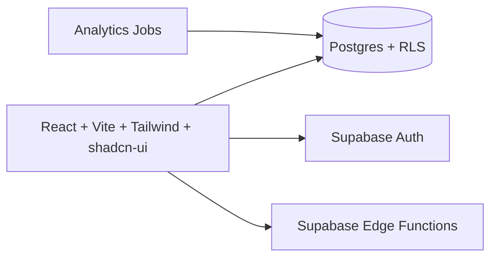
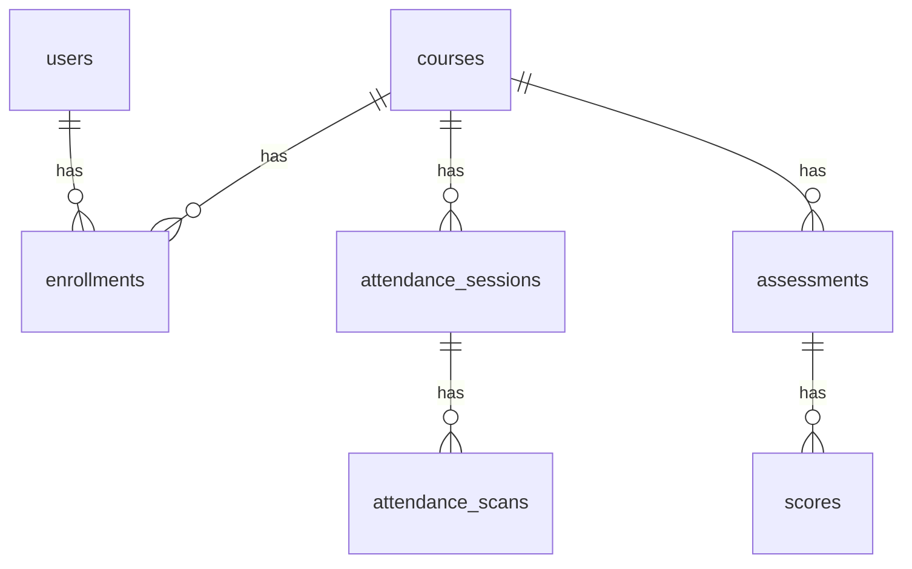
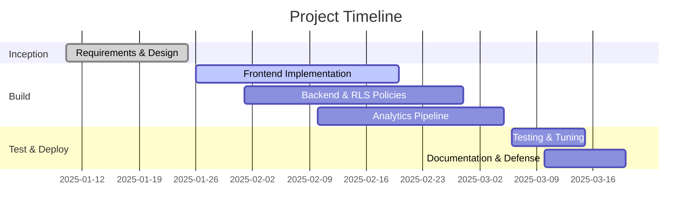

# EduTrack — Final Year Project Defense Deck (Markdown)

Team: Fritzgerald · Fredricka · Vanessa  
Title: AI-Powered Student Engagement Analytics for Higher Education

Note: Each slide includes speaker notes. Convert to PowerPoint/Google Slides as needed.

---

## Slide 1 — Title & Team
- EduTrack: AI-Powered Student Engagement Analytics
- Team: Fritzgerald · Fredricka · Vanessa
- Supervisor, Department, University, Date

Speaker Notes:
- Briefly introduce the problem space and our one-line solution.

---

## Slide 2 — Problem & Motivation
- Manual attendance is error-prone and time-consuming
- Delayed visibility into at-risk students
- Fragmented data across tools; difficult to act quickly

Speaker Notes:
- Share a quick anecdote/statistic from literature to anchor motivation.

---

## Slide 3 — Solution Overview
- Secure QR attendance + continuous assessment capture
- AI insights: at-risk detection, trend forecasts
- Role-based dashboards (Lecturer, Student, Admin) + CSV export

Speaker Notes:
- Emphasize actionability — insights that trigger timely interventions.

---

## Slide 4 — Live Demo Plan
- Landing: value proposition
- Lecturer Dashboard: stats and navigation
- Courses -> Course Detail: sessions and assessments
- AI Insights: risk list and trends
- Reports: CSV export

Speaker Notes:
- Keep demo < 6 minutes; show end-to-end flow using seeded data.

---

## Slide 5 — System Architecture

Speaker Notes:
- Highlight how RLS enforces per-user access and how Edge Functions validate scans.

---

## Slide 6 — Data Model (ERD)

Speaker Notes:
- Explain unique constraints (session_id, student_id) to prevent double attendance.

---

## Slide 7 — AI/Analytics Approach
- Features: attendance trend, assessment average, timeliness, volatility
- Models: Logistic Regression baseline + Tree-based ensemble
- Outputs: risk_score (0–1), risk band, recommended action

Speaker Notes:
- Mention evaluation metrics: AUROC and precision@k for targeted interventions.

---

## Slide 8 — Security & Privacy
- AuthN: Supabase Auth; AuthZ: Postgres RLS
- Encryption in transit and at rest
- PII minimization; signed QR payloads (ids + nonce)

Speaker Notes:
- Map controls to GDPR/FERPA principles at a high level.

---

## Slide 9 — Implementation Highlights
- Responsive UI with semantic HTML and accessible components
- QR attendance generation and idempotent scan handling
- Admin CSV export; charts for insights

Speaker Notes:
- Tie each highlight back to user value.

---

## Slide 10 — Testing & Results
- Unit/integration tests for key flows
- Synthetic evaluation: AUROC ~0.86, precision@10 ~0.7
- User feedback: clear dashboards and easy exports

Speaker Notes:
- Be honest about dataset limitations; emphasize methodology rigor.

---

## Slide 11 — Limitations
- Synthetic datasets for evaluation
- Institutional integration (LMS/SIS) pending
- Camera-based scanning on mobile: planned

Speaker Notes:
- Frame limitations as opportunities with concrete next steps.

---

## Slide 12 — Future Work
- Real LMS/SIS connectors and expanded signals
- Explainable AI and intervention workflows
- Mobile app; A/B testing of nudges

Speaker Notes:
- Prioritize items with the highest expected impact.

---

## Slide 13 — Team Contributions
- Fritzgerald: Architecture, backend schema, security
- Fredricka: Frontend UI/UX, dashboards, CSV export
- Vanessa: Analytics pipeline, evaluation, documentation

Speaker Notes:
- Show collaboration and code reviews across areas.

---

## Slide 14 — Timeline

Speaker Notes:
- Note parallel workstreams and checkpoints.

---

## Slide 15 — Q&A
- Thank you
- Repo and demo link

Speaker Notes:
- Prepare answers to: data privacy, model bias, robustness, scalability.

---

## Appendix — Demo Script (5–6 min)
1) Landing: 10s — One-liner value.
2) Lecturer Dashboard: 40s — Stats and navigation.
3) Courses -> Course Detail: 2 min — Create attendance session (explain expiry) and view assessments.
4) Student Portal: 1 min — Show join/scan flow (explain validation).
5) AI Insights: 1.5 min — Risk list, explain features and thresholds.
6) Reports: 30s — Export CSV.

## Appendix — Risk Interpretation Guide
- 0.8–1.0: Immediate intervention (advisor outreach)
- 0.5–0.8: Nudges and study-plan suggestions
- < 0.5: Monitor only
