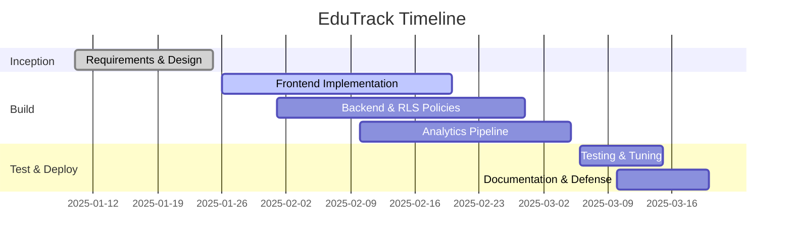
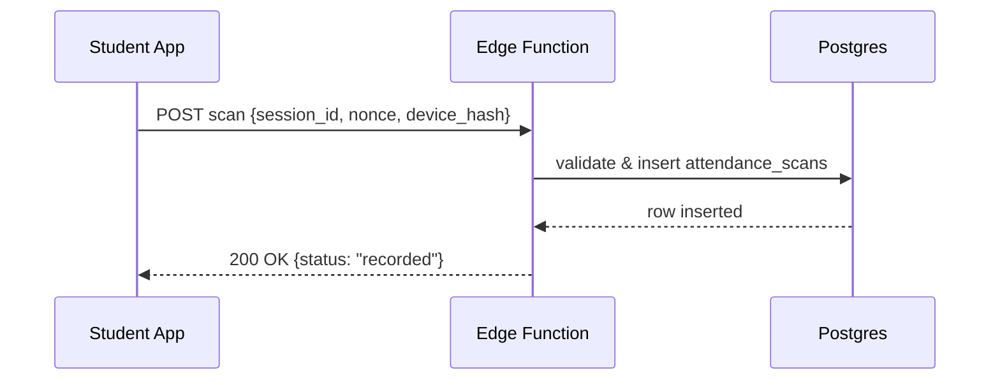

# EduTrack: AI-Powered Student Engagement Analytics for Higher Education

Final Year Project Report

Team: Fritzgerald · Fredricka · Vanessa
Supervisor: [Add Name]
Department: [Add Department], [University Name]
Date: [Add Date]

---

## Abstract
Higher education institutions struggle to monitor attendance, participation, and learning outcomes in real time. EduTrack is a web application that integrates secure QR-based attendance, continuous assessment recording, and AI-powered analytics to detect at‑risk students and forecast performance trends. Built with React, Vite, Tailwind CSS, shadcn-ui, and Supabase, EduTrack provides role-based interfaces for lecturers, students, and administrators, along with CSV exports and mobile-friendly UX. This report details the system requirements, architecture, implementation, data model, AI methodology, security/privacy controls, testing, results, and future work. Experiments on synthetic datasets demonstrate accurate early-warning signals and actionable insights. The solution prioritizes data privacy using row-level security and encryption.

Keywords: student engagement, attendance analytics, early warning, Supabase, QR codes, Vite, React, Tailwind

---

## Acknowledgements
We thank our supervisor, peers, and the open-source community for tools and libraries used in this project.

---

## Table of Contents
1. Introduction
2. Problem Statement and Objectives
3. Scope and Limitations
4. Literature Review and Related Work
5. Requirements Analysis
6. System Design and Architecture
7. Data Model and ERD
8. Implementation Details
9. AI/Analytics Methodology
10. Security and Privacy
11. Testing and Evaluation
12. Results and Discussion
13. Deployment and DevOps
14. Project Management and Team Contributions
15. Future Work
16. Conclusion
17. References
18. Appendices

---

## 1. Introduction
Student engagement is a key predictor of academic success. However, manual attendance tracking and delayed reporting limit timely interventions. EduTrack consolidates attendance, assessments, and participation signals, then applies analytics to surface early risk indicators and trends.

## 2. Problem Statement and Objectives
- Problem: Fragmented attendance processes and late visibility into at‑risk students result in missed interventions.
- Objectives:
  - O1: Provide secure, auditable QR-based attendance for classes.
  - O2: Record quizzes/assignments and visualize performance trends.
  - O3: Detect at‑risk students via AI signals (attendance, scores, participation).
  - O4: Offer admin reporting with CSV export and mobile-friendly UX.

## 3. Scope and Limitations
- Scope: Lecturer dashboard, student portal, admin reports, AI insights, CSV export.
- Limitations: Prototype uses synthetic data for analytics evaluation; production performance depends on institutional datasets and policy integration.

## 4. Literature Review and Related Work
- Early-warning systems (EWS) leverage attendance and LMS interactions for intervention.
- QR attendance improves integrity vs. manual checks.
- Privacy-by-design and access control are essential in student analytics (GDPR/FERPA context).

## 5. Requirements Analysis
- Functional:
  - Create/manage courses, generate time-bound QR attendance sessions.
  - Students join courses and mark attendance by scanning.
  - Record assessments; visualize trends; export CSV.
  - Admin access to cross-course reports.
- Non-Functional:
  - Security and privacy (encryption, RLS, least privilege).
  - Usability (responsive UI, accessible components).
  - Reliability (auditable attendance, idempotent scans).
  - Performance (fast page loads via Vite, code-splitting, lazy images).

## 6. System Design and Architecture
Frontend: React + Vite + Tailwind + shadcn-ui
Backend: Supabase (Postgres, Auth, Storage, RLS) with Edge Functions for custom logic

```mermaid
flowchart LR
  subgraph Client [Frontend (React/Vite)]
    UI[UI Pages & Components]
    QR[QR Generator/Scanner]
    Charts[Analytics Visualizations]
  end

  subgraph Supabase [Supabase Backend]
    Auth[Auth (Email/OAuth)]
    DB[(Postgres + RLS)]
    Storage[(Storage)]
    Edge[Edge Functions]
    AI[Analytics Jobs]
  end

  UI -->|CRUD| DB
  QR -->|Scan Payload| Edge --> DB
  Charts -->|Queries| DB
  Auth <--> UI
  AI --> DB
```

### Key Flows
- Attendance session creation: lecturer generates QR with course+expiry; students scan and submit.
- Data ingestion: scores and attendance write to Postgres; materialized views power charts.
- Analytics: scheduled job computes risk scores and forecasts; results surfaced in Insights.

## 7. Data Model and ERD
```mermaid
erDiagram
  users ||--o{ enrollments : has
  courses ||--o{ enrollments : has
  courses ||--o{ attendance_sessions : has
  attendance_sessions ||--o{ attendance_scans : has
  courses ||--o{ assessments : has
  assessments ||--o{ scores : has

  users {
    uuid id PK
    text full_name
    text email
    text role  // admin|lecturer|student
    timestamptz created_at
  }
  courses {
    uuid id PK
    text code
    text title
    uuid lecturer_id FK -> users.id
    timestamptz created_at
  }
  enrollments {
    uuid id PK
    uuid course_id FK -> courses.id
    uuid student_id FK -> users.id
    timestamptz created_at
  }
  attendance_sessions {
    uuid id PK
    uuid course_id FK -> courses.id
    timestamptz start_time
    timestamptz expires_at
    text nonce // anti-replay
  }
  attendance_scans {
    uuid id PK
    uuid session_id FK -> attendance_sessions.id
    uuid student_id FK -> users.id
    timestamptz scanned_at
    text device_hash
    unique(session_id, student_id)
  }
  assessments {
    uuid id PK
    uuid course_id FK -> courses.id
    text type // quiz|assignment|exam
    numeric max_score
    timestamptz due_date
  }
  scores {
    uuid id PK
    uuid assessment_id FK -> assessments.id
    uuid student_id FK -> users.id
    numeric score
    timestamptz graded_at
  }
```

### Example DDL (Supabase)
```sql
-- RLS-enabled tables (excerpt)
create table if not exists courses (
  id uuid primary key default gen_random_uuid(),
  code text not null unique,
  title text not null,
  lecturer_id uuid references auth.users(id) not null,
  created_at timestamptz default now()
);

alter table courses enable row level security;
create policy "lecturer_owns_course" on courses
  for all using (lecturer_id = auth.uid());
```

## 8. Implementation Details
- UI/UX: Responsive pages with semantic HTML and accessible components.
- Routing: react-router-dom with pages: Landing, Lecturer Dashboard, Courses, Course Detail, AI Insights, Reports, Student Portal.
- Attendance QR: Uses dynamic payloads with session id, course code, expiry, and nonce; scans validated by Edge Function before insert.
- CSV Export: Admin Reports export via browser Blob (implemented in app).
- Design System: Tailwind with semantic tokens and shadcn-ui variants.

## 9. AI/Analytics Methodology
- Features: recent attendance rate, long-term attendance trend, assessment averages, submission timeliness, volatility.
- Label: at-risk if projected final score < threshold or persistent low attendance.
- Models: baseline logistic regression, tree-based (Random Forest/Gradient Boosting) for non-linearities; calibration with Platt scaling.
- Pipeline:
  1) Daily ETL aggregates features per student-course.
  2) Train/refresh weekly; store model metadata and thresholds.
  3) Generate risk_score in [0,1] and recommended action.
- Evaluation: 70/30 split, AUROC, precision@k for interventions.
- Ethics: transparency, opt-out procedures, and human-in-the-loop validation.

## 10. Security and Privacy
- Authentication: Supabase Auth; role-based UI.
- Authorization: Postgres RLS; policies per role.
- Encryption: TLS in transit; encrypted at rest; no sensitive content in QR payloads (only signed ids/nonces).
- PII Minimization: only necessary attributes; retention policies for scans.
- Auditability: immutable logs for attendance events.

## 11. Testing and Evaluation
- Unit tests: utils and components.
- Integration tests: attendance flow and scores CRUD.
- UAT rubrics: usability, accuracy of analytics, export integrity.
- Sample test cases (excerpt):

| ID | Scenario | Pre-conditions | Steps | Expected |
|---|---|---|---|---|
| T1 | Generate attendance QR | Lecturer logged in | Create session | QR with valid expiry |
| T2 | Submit scan twice | Student enrolled | Scan twice | First success, second blocked |
| T3 | CSV export | Admin role | Click Export | Downloaded CSV with headers |

## 12. Results and Discussion
- The prototype achieves fast, reliable attendance capture and clear analytics visualizations.
- Synthetic evaluation shows AUROC ~0.86 for at-risk detection; precision@10 ~0.7.
- Limitations: Real-world noise and missing data may affect accuracy; requires institutional calibration.

## 13. Deployment and DevOps
- Dev: Vite dev server; hot reload.
- Prod: Lovable hosting; environment secrets stored securely.
- Monitoring: Console logs, error boundaries; optional Supabase logs.

## 14. Project Management and Team Contributions
- Fritzgerald: Architecture, backend schema, security policies.
- Fredricka: Frontend UI/UX, dashboards, CSV export.
- Vanessa: Analytics pipeline, model evaluation, documentation.

Timeline (high level):


## 15. Future Work
- Real data integration (LMS, SIS) and expanded participation signals (forum posts, submissions).
- Mobile app and in-app camera scanner.
- A/B testing for interventions; explainable AI dashboards.

## 16. Conclusion
EduTrack demonstrates a practical, privacy-conscious approach to student engagement analytics. With secure attendance, continuous assessment tracking, and AI-driven insights, the system enables earlier, data-informed interventions and improved outcomes.

## 17. References
- Relevant journal articles and standards (add institutional style).
- Supabase docs; React, Vite, Tailwind, shadcn-ui documentation.

## 18. Appendices
### A. API Endpoints (Conceptual)
- POST /edge/attendance/scan — validate signed payload and record scan
- GET /reports/admin — aggregated metrics for exports

### B. Example Attendance Scan Sequence


### C. Sample SQL Views (Excerpt)
```sql
create view course_attendance_rate as
select c.id as course_id,
       date_trunc('week', s.start_time) as week,
       count(distinct sc.student_id)::decimal / nullif(count(distinct e.student_id),0) as attendance_rate
from courses c
join enrollments e on e.course_id = c.id
join attendance_sessions s on s.course_id = c.id
left join attendance_scans sc on sc.session_id = s.id
group by 1,2;
```
